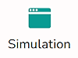
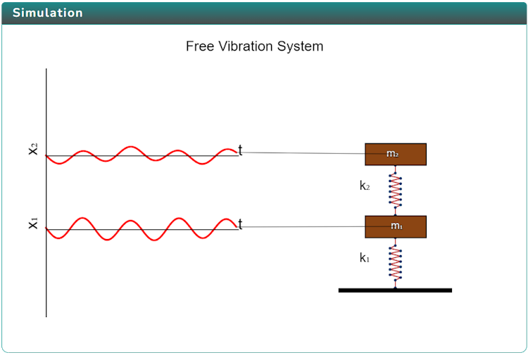
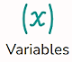
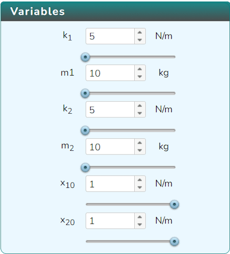
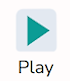
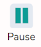
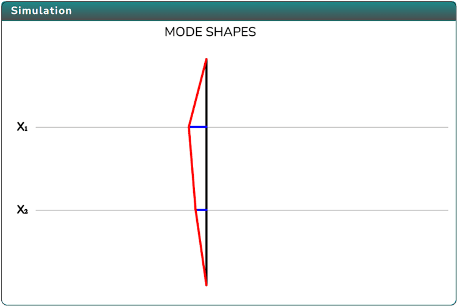
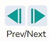
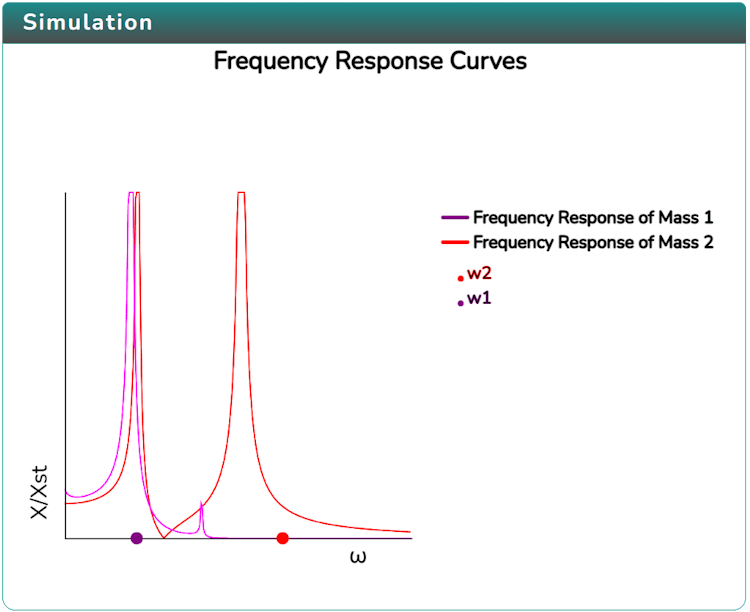
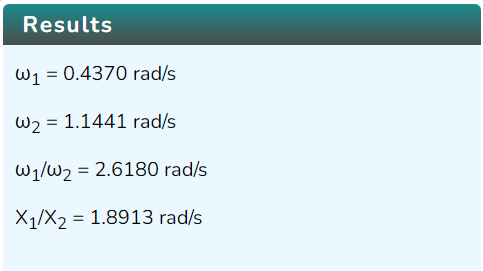

### Procedure

1. Click on the Simulation icon  to view the simulation.

   

2. In order to view the variable section click on the Variable icon. 

   

3. Click on Play icon  to run the simulation and click on Pause icon  to stop it.

4. Click on the Next icon  to go further.

   

5. Click on the Next or Prev icon to cycle through different pages.

   

6. Click on the Result icon  to view the result tab.

   

7. Click on the Refresh icon  to restart the experiment.
