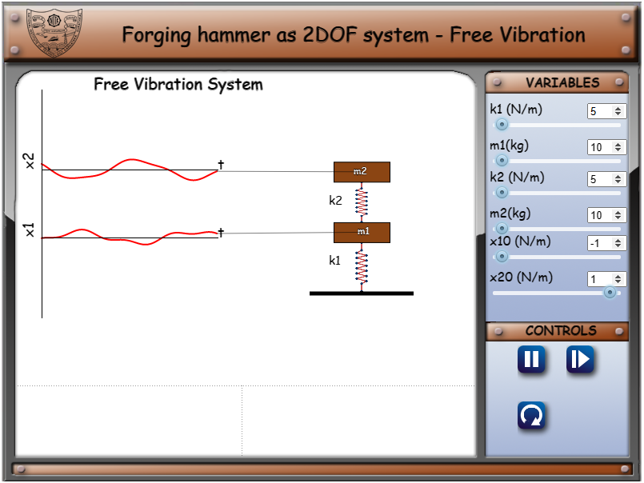
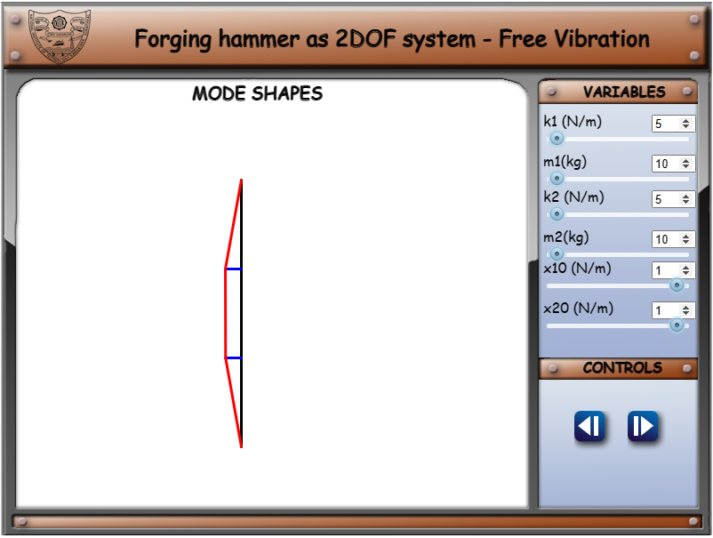
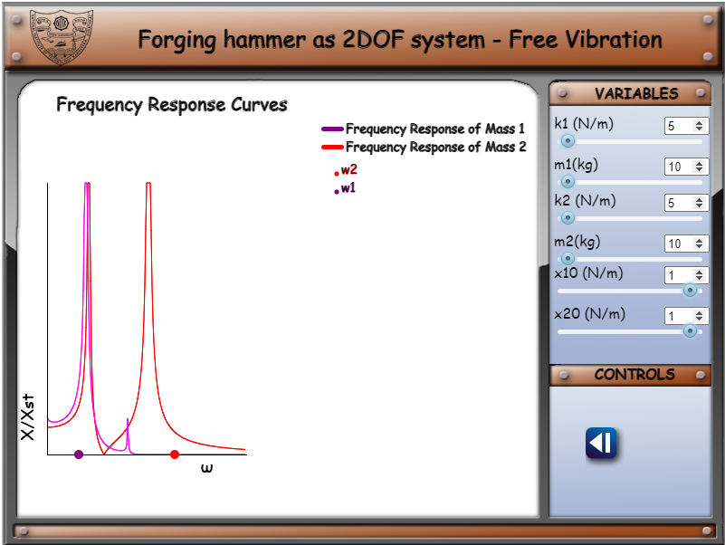

Given Data:
m1 - Mass of the base (kg)  
k1 - Stiffness of the base (N/m)  
m2 - Mass of the anvil (kg)  
k2 - Stiffness of the anvil (N/m)  

1. On clicking the simulation tab, the first page is displayed as shown below.

Here, the user can set k1, m1, k2 and m2 to view different responses.

 

2. On clicking the next button, the mode shapes will be displayed, while the simulation is running.

 

3. The third page shows the frequency response curves.

